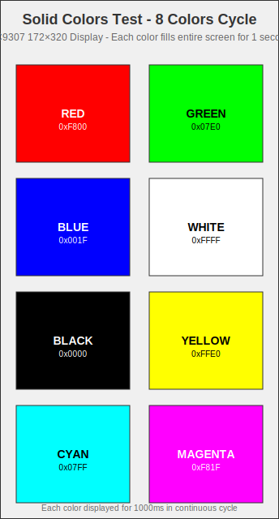
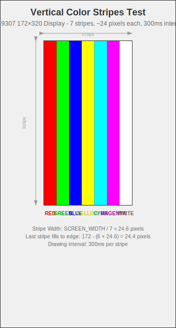
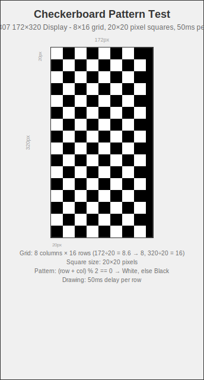

# GC9307 Direct SPI Test

A direct SPI test program that bypasses the gc9307-async driver library to verify GC9307 display hardware connections and basic functionality.

## Hardware Configuration

### Display Specifications

- **Model**: GC9307 1.47" IPS Display
- **Resolution**: 172RGB×320 pixels
- **Communication**: SPI
- **Color Format**: RGB565 (16-bit)

### Pin Connections (STM32G431)

```text
SPI1 Configuration:
- SCK:  PB3
- MOSI: PB5
- Frequency: 10MHz

Control Pins:
- DC (Data/Command): PC14
- RST (Reset):       PC15
- CS (Chip Select):  PA15
```

## Features

### 1. Complete Initialization Sequence

- Based on official initialization sequence from `docs/1.47寸IPS初始化GC9307+HSD.txt`
- Includes hardware reset, unlock commands, display configuration, gamma correction, etc.
- Supports 172×320 resolution and RGB565 color format

### 2. Basic Display Operations

- `fill_color()` - Full screen color fill
- `fill_rect()` - Rectangle area fill
- `set_address_window()` - Set drawing area
- Direct SPI communication functions

### 3. Test Modes

#### Test 1: Solid Colors

Cycles through the following colors, each displayed for 1 second:

- Red
- Green
- Blue
- White
- Black
- Yellow
- Cyan
- Magenta

**Purpose**: Verify basic color display and full screen fill functionality

#### Test 2: Vertical Color Stripes

Draws 7 vertical color stripes, each approximately 24 pixels wide:

- Different colors displayed from left to right
- Progressive drawing with 300ms interval between stripes

**Purpose**: Verify address window setting and rectangle fill functionality

#### Test 3: Checkerboard Pattern

Draws black and white checkerboard pattern:

- Square size: 20×20 pixels
- Grid: 8 columns × 16 rows
- Progressive drawing with 50ms interval per row

**Purpose**: Verify pixel precision and complex pattern rendering

## Visual Display Examples

The following images show the expected display output for each test mode:

### Solid Colors Display



This test cycles through 8 solid colors, each filling the entire 172×320 display for 1 second:

- **Red** (0xF800) - Pure red fill
- **Green** (0x07E0) - Pure green fill
- **Blue** (0x001F) - Pure blue fill
- **White** (0xFFFF) - Pure white fill
- **Black** (0x0000) - Pure black fill
- **Yellow** (0xFFE0) - Pure yellow fill
- **Cyan** (0x07FF) - Pure cyan fill
- **Magenta** (0xF81F) - Pure magenta fill

**Performance**: Each color fill demonstrates full-screen rendering capability with direct SPI communication.

### Vertical Color Stripes Display



This test draws 7 vertical color stripes with progressive rendering:

- **Stripe Width**: ~24.6 pixels each (172 ÷ 7)
- **Colors**: Red, Green, Blue, Yellow, Cyan, Magenta, White
- **Drawing Interval**: 300ms between stripes
- **Last Stripe**: Fills remaining width to screen edge

**Purpose**: Validates address window setting and rectangle fill operations with precise coordinate control.

### Checkerboard Pattern Display



This test creates a black and white checkerboard pattern:

- **Grid Size**: 8 columns × 16 rows
- **Square Size**: 20×20 pixels each
- **Pattern Logic**: `(row + col) % 2 == 0` determines white squares
- **Background**: Black (0x0000) with white (0xFFFF) squares
- **Drawing Speed**: 50ms delay per row for visual feedback

**Purpose**: Tests pixel-perfect rendering accuracy and complex pattern generation.

## Build and Run

### Compilation

```bash
cd examples/stm32g4-direct-spi
cargo build --release
```

### Flash to Hardware

Use your preferred flashing tool, for example:

```bash
# Using probe-rs
cargo run --release

# Or using OpenOCD + GDB
# Specific commands depend on your debugger configuration
```

## Expected Behavior

1. **Initialization Phase**:
   - Display performs hardware reset first
   - Then executes complete initialization sequence
   - Test loop begins after successful initialization

2. **Test Loop**:
   - Each test mode waits 3 seconds after completion
   - Then automatically switches to the next test mode
   - Cycles through all test modes continuously

3. **Log Output**:
   - Detailed log information available if debugger is connected
   - Includes initialization progress, test mode transitions, etc.

## Troubleshooting

### No Display Output

1. Check hardware connections are correct
2. Verify power supply is stable
3. Check if SPI clock frequency is too high
4. Verify control pin configuration

### Display Anomalies

1. Check if initialization sequence executed completely
2. Verify display resolution configuration is correct
3. Check if color format matches

### Compilation Errors

1. Ensure Embassy version and STM32G431 features are enabled
2. Check dependency version compatibility

## Code Structure

- `main.rs` - Main program containing complete driver implementation and test code
- `Display` struct - Encapsulates SPI communication and display operations
- Test functions - Implement various test modes

## Differences from Driver Library

Key differences between this test program and the `gc9307-async` driver library:

1. **Direct SPI Operations**: No dependency on driver library, uses Embassy SPI directly
2. **Simplified Error Handling**: Focuses on functionality verification with simplified error handling
3. **Hardcoded Configuration**: Optimized for specific hardware configuration
4. **Test-Oriented**: Includes multiple test modes for easy hardware verification

This makes it ideal for:

- Hardware connection verification
- Initialization sequence debugging
- Driver library issue diagnosis
- Performance benchmarking
