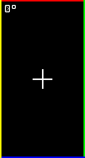
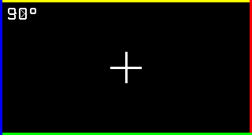
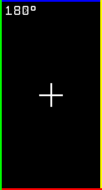
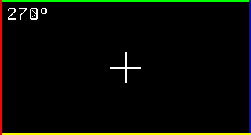

# GC9307 Software Rotation Example

This example demonstrates pure software-based screen rotation for the GC9307 display controller with high-quality 12×16 pixel font rendering for rotation angle display.

## Features

- **Pure Software Rotation**: Implements rotation through coordinate transformation, without modifying GC9307 registers
- **High-Quality Font Rendering**: 12×16 pixel bitmap font for clear angle display (0°, 90°, 180°, 270°)
- **Orientation Test Pattern**: Displays a crosshair with colored borders to visualize rotation
- **Automatic Rotation Cycle**: Cycles through 0°, 90°, 180°, 270° rotations every 2.5 seconds
- **Real-time Angle Display**: Shows current rotation angle in top-left corner with pixel-perfect rendering

## Visual Display Examples

The following images show the display output at each rotation angle:

### 0° Rotation - Portrait Mode



### 90° Rotation - Landscape Mode



### 180° Rotation - Inverted Portrait Mode



### 270° Rotation - Inverted Landscape Mode



## Test Pattern Description

The orientation test pattern includes:

1. **Rotation Angle Text**: 12×16 pixel font displaying current angle (0°, 90°, 180°, 270°) in top-left corner
2. **Center Crosshair**: White cross mark at screen center (3px line width)
3. **Colored Borders**: 3px wide borders in different colors:
   - Top: Red
   - Right: Green
   - Bottom: Blue
   - Left: Yellow

## Expected Behavior

- **0°**: Red top, Green right, Blue bottom, Yellow left, "0°" text top-left
- **90°**: Yellow top, Red right, Green bottom, Blue left, "90°" text top-left
- **180°**: Blue top, Yellow right, Red bottom, Green left, "180°" text top-left
- **270°**: Green top, Blue right, Yellow bottom, Red left, "270°" text top-left

## Font Features

- **12×16 Pixel Font**: High-quality bitmap font for clear readability
- **Complete Character Set**: Digits 0-9 and degree symbol (°)
- **Diagonal Lines**: Number 0 includes diagonal lines for better distinction
- **Pixel-Perfect Rendering**: Each character rendered with precise 1×1 pixel control
- **Anti-Mirroring**: Correct bit order ensures characters display properly

## Hardware Setup

- STM32G431CB microcontroller
- GC9307 display (172×320 resolution)
- SPI connection: SCK=PB3, MOSI=PB5, DC=PC14, RST=PC15, CS=PA15

## Usage

```bash
cargo run --release
```

Monitor the output via RTT/defmt to see rotation state changes and coordinate transformations.
