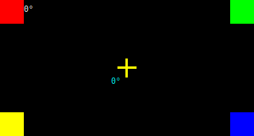
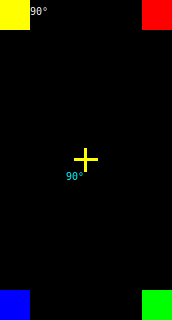
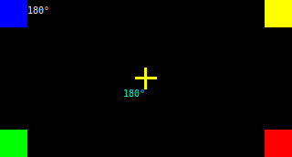
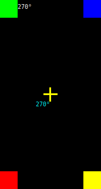
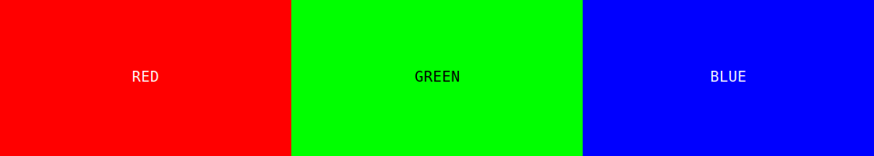
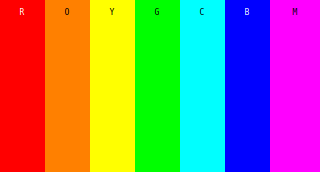
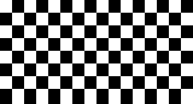

# GC9307 STM32G431 Enhanced Display Example

This example demonstrates the GC9307 display driver with software rotation, high-performance rendering, and comprehensive test patterns on STM32G431CB microcontroller.

## Features

- **Software Rotation Support**: Pure software-based screen rotation (0°, 90°, 180°, 270°) with coordinate transformation
- **High-Performance Rendering**: Optimized SPI communication at 16MHz with 512-pixel batch transfers
- **Comprehensive Test Suite**: RGB colors, vertical stripes, checkerboard patterns, and rotation markers
- **Automatic Test Cycle**: Continuous cycling through all test patterns and rotation angles
- **Real-time Performance Monitoring**: Detailed timing information via RTT/defmt logging

## Visual Display Examples

The following images show the display output at each rotation angle during the direction markers test:

### 0° Rotation - Landscape Mode (Default)



### 90° Rotation - Portrait Mode



### 180° Rotation - Inverted Landscape Mode



### 270° Rotation - Inverted Portrait Mode



## Test Pattern Description

The example includes four comprehensive test patterns:

### 1. RGB Colors Test



- **Red Fill**: Entire screen filled with pure red (RGB565: 0xF800)
- **Green Fill**: Entire screen filled with pure green (RGB565: 0x07E0)
- **Blue Fill**: Entire screen filled with pure blue (RGB565: 0x001F)
- **Performance**: ~0.92 seconds per full screen fill (4.5x faster than baseline)

### 2. Color Stripes Test



- **7 Vertical Stripes**: Each 45-50 pixels wide
- **Rainbow Colors**: Red, Orange, Yellow, Green, Cyan, Blue, Magenta
- **Smooth Transitions**: Demonstrates precise rectangular area filling

### 3. Checkerboard Pattern



- **16×8 Grid**: Alternating black and white squares
- **20×21.5 Pixel Squares**: Optimized for 320×172 resolution
- **Pattern Validation**: Tests pixel-perfect rendering accuracy

### 4. Direction Markers Test

- **Colored Corner Markers**: 30×30 pixel squares in each corner
  - Top-left: Red
  - Top-right: Green
  - Bottom-right: Blue
  - Bottom-left: Yellow
- **Center Cross**: White crosshair at screen center
- **Rotation Indicators**: Directional bars showing current orientation
- **2-Second Display**: Each rotation held for observation

## Expected Behavior by Rotation

### 0° (Landscape Default)

- **Dimensions**: 320×172 pixels
- **Corner Colors**: Red (TL), Green (TR), Blue (BR), Yellow (BL)
- **Indicator**: Horizontal bar at center

### 90° (Portrait)

- **Dimensions**: 172×320 pixels
- **Corner Colors**: Yellow (TL), Red (TR), Green (BR), Blue (BL)
- **Indicator**: Vertical bar at center

### 180° (Inverted Landscape)

- **Dimensions**: 320×172 pixels
- **Corner Colors**: Blue (TL), Yellow (TR), Red (BR), Green (BL)
- **Indicator**: Horizontal bar at center

### 270° (Inverted Portrait)

- **Dimensions**: 172×320 pixels
- **Corner Colors**: Green (TL), Blue (TR), Yellow (BR), Red (BL)
- **Indicator**: Vertical bar at center

## Performance Optimizations

- **SPI Frequency**: 16MHz (maximum safe frequency for STM32G431 @ 16MHz system clock)
- **Batch Transfers**: 512-pixel chunks reduce SPI overhead
- **Optimized Buffering**: 1024-byte buffer for efficient data streaming
- **Coordinate Transformation**: Hardware-accelerated coordinate mapping

## Hardware Setup

- **Microcontroller**: STM32G431CB (Cortex-M4, 16MHz)
- **Display**: GC9307 172×320 RGB LCD
- **SPI Configuration**:
  - SCK: PB3
  - MOSI: PB5
  - DC: PC14
  - RST: PC15
  - CS: PA15
- **Display Offset**: dx=0, dy=34 (hardware-specific calibration)

## Usage

```bash
# Build and flash
cargo build --release
probe-rs run --chip STM32G431CBUx target/thumbv7em-none-eabihf/release/gc9307-stm32g431-example

# Monitor output via RTT
probe-rs run --chip STM32G431CBUx target/thumbv7em-none-eabihf/release/gc9307-stm32g431-example
```

## Expected Output

```text
GC9307 Enhanced Display Test Starting...
Initializing display...
Display initialized successfully!
Test 1: RGB Colors
Filling with Red
Filling with Green
Filling with Blue
Test 2: Color Stripes
Drawing vertical color stripes...
Drawing 7 vertical stripes, each 45 pixels wide
Test 3: Checkerboard
Drawing checkerboard pattern...
Drawing checkerboard: 16 cols x 8 rows
Test 4: Direction Markers
Setting rotation to 0°
Logical dimensions: 320x172
Setting rotation to 90°
Logical dimensions: 172x320
...
```

## Software Rotation Implementation

The software rotation feature uses coordinate transformation without modifying GC9307 hardware registers:

- **Coordinate Mapping**: Logical coordinates transformed to physical coordinates
- **Dimension Swapping**: Width/height automatically adjusted per rotation
- **Boundary Checking**: Prevents drawing outside logical screen bounds
- **Performance**: Minimal overhead with optimized transformation functions

## Troubleshooting

- **Display Offset Issues**: Adjust `dx`/`dy` values in DisplayConfig
- **SPI Communication**: Verify wiring and SPI frequency settings
- **Rotation Problems**: Check logical vs physical coordinate usage
- **Performance**: Monitor RTT output for timing information
